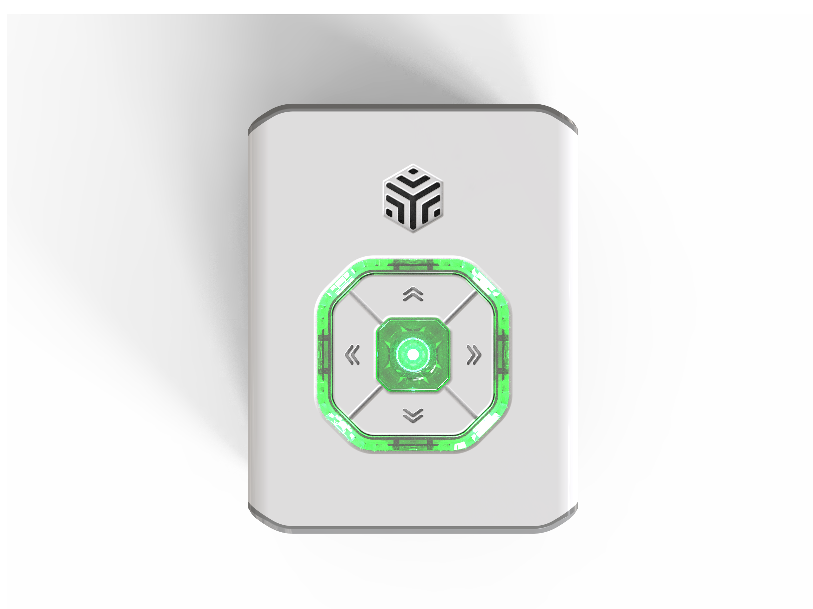
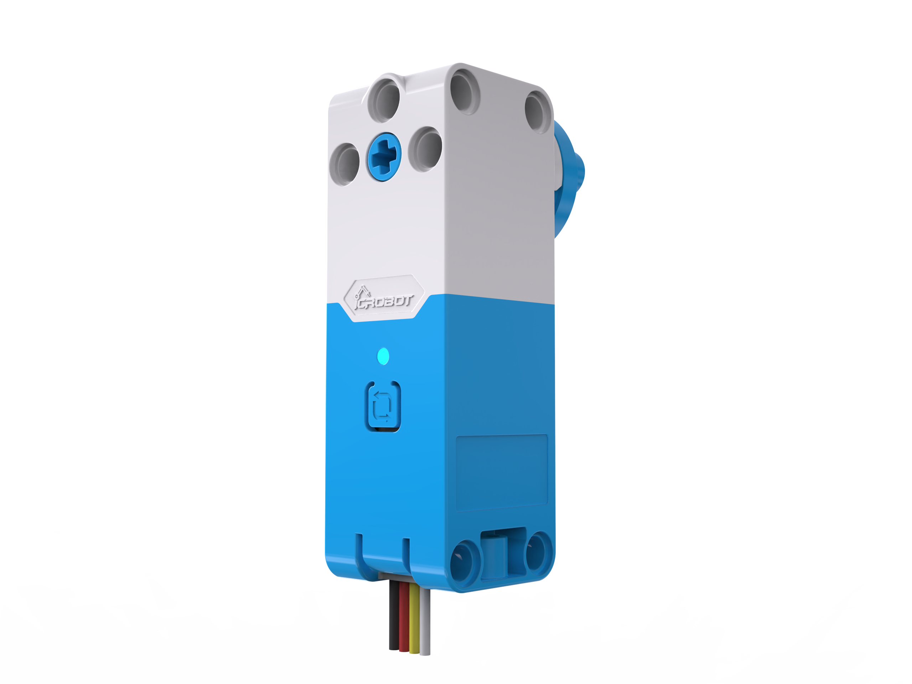
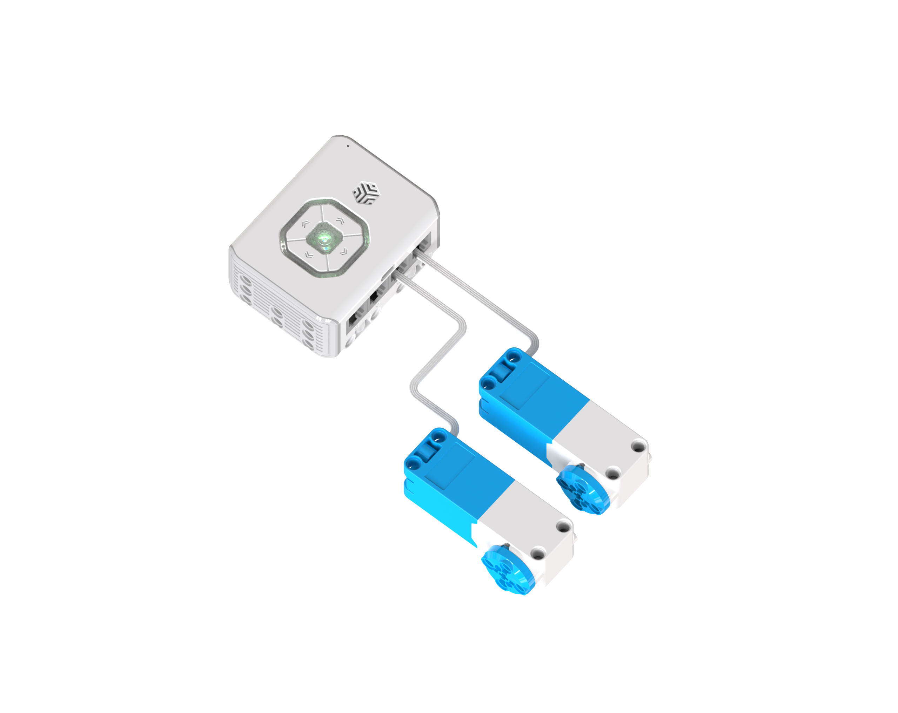
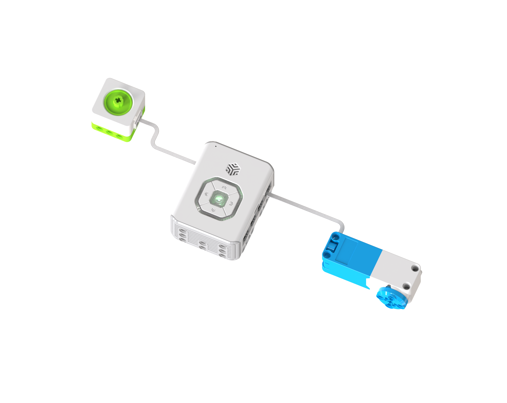

# Quick Start
If you are using this product for the first time, it is recommended to carefully read this section. By completing a few simple practical cases, you can quickly learn how to create with ICBricks. For experienced users, you may skim through or skip to later sections to explore more advanced features and application techniques.  
With these curated examples, you will quickly master ICBricks' operation methods and experience its powerful functionality and creative joy!  

## Power On  
Press and hold the hub’s power button for 2s to turn it on. A short prompt sound will play during startup. Once successfully powered on, the indicator light and button breathing light will remain steady.   

## Direct Control: Controlling the Motor  
### Preparation
|  |  |
| :---: | :---: |
| ICBricks Hub × 1 |  Servo Motors  × 2    Servo Motor Adapter Cables × 2   |

### Steps:  
 1.  Connect the Motors  

Power on the main controller. Use the servo motor adapter cables to connect the two motors to ports 2 and 4. When connected successfully, the motors will emit a prompt sound.  

### Demonstration  
Press the up and down buttons on the hub to observe the movement of the servo motors.  

## Logical Control: Encoder Sensor Controls Motor  
### Preparation
|  |  |  |
| :---: | :---: | :---: |
| ICBricks Hub × 1 |  Servo Motor × 1   RJ11 to Grove Cable × 1 |  Encoder Sensor × 1    6P Crystal Head Cable × 1   |

###  Connect Sensor and Actuator  
Power on the hub. Use the RJ11 cable to connect the encoder sensor to port 1 of the hub. Connect the servo motor to port 2 using the RJ11 to grove cable.  

### Demonstration  
Rotate the encoder sensor left and right to observe the movement of the servo motor.  

### Software Programming  
#### Install the Software  
For Android Phone and tablet：** Click the following link to download the installation package: **👉** **[**[Software Installation]**](https://drive.google.com/file/d/1hVLuggfW94oNK4z1C7KD4covAsvXX-bs/view?usp=drive_link)**  **

For iPhone and iPad：Please search "ICBricks" in AppStore to install.

#### Steps for Programming  
**Step 1: Connect Bluetooth  **

Before using the programming software, ensure that location and Bluetooth permissions are enabled, and the hub is powered on.  

Open the ICBricks programming software, tap the Bluetooth button, select the hub's name, and click connect.  

