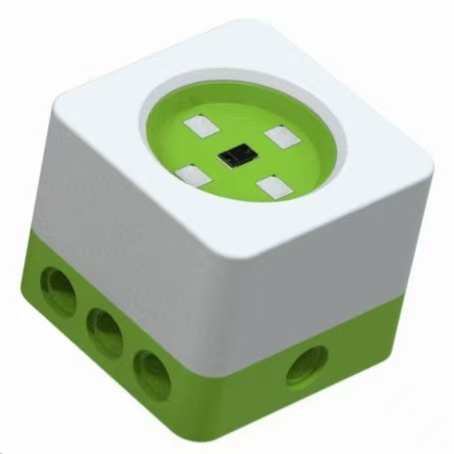
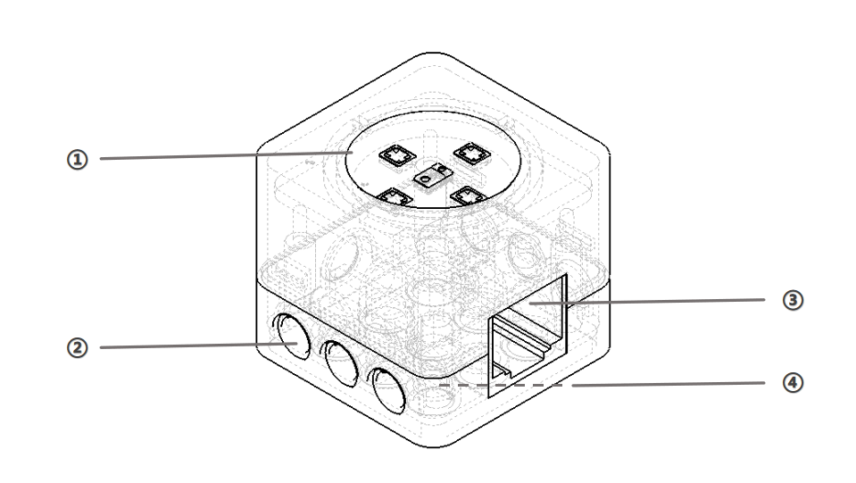

# Distance Sensor

## **Introduction**
The distance sensor detects the distance between objects and the sensor, with a detection range of 0~255 cm.  

Using laser reflection principles, the sensor measures the round-trip time of laser signals to calculate the absolute distance between the sensor and the target. The sensor emits laser at a wavelength of 940 nm and completes distance measurements up to 2 meters in under 30 ms.  

_**Note:**__ The VL6180X measures distance based on __**Time-of-Flight (ToF)**__ technology. Therefore, its measurement accuracy is affected by the target's surface reflectivity, material properties, and orientation._

1. _**Target Reflectivity:**__ Black or highly light-absorbing materials can significantly reduce the maximum measurable distance. _
2. _**Ambient Light:**__ Strong sunlight or infrared interference may affect measurement consistency. _
3. _**Angle of Incidence:**__ When the target surface is not perpendicular to the sensor (incidence angle > 10°), reduced reflected light intensity may introduce measurement errors. _
4. _**Temperature Drift:**__ Changes in the sensor's internal temperature may cause slight variations in the absolute distance measurement. _
5. _**Optical Cover and Window Material:**__ If an external lens or protective window is used, factory calibration and compensation are recommended to ensure optimal measurement accuracy._

## Structure  

| No.   | Name   | Description   |
| :---: | :---: | :---: |
| ① | Icon | Green imprint for module type identification   |
| ② | Pinhole |  Connects and secures building blocks via pinholes   |
| ③ |  RJ11 Port   | Applicable to the crystal head connecting cable   |
| ④ |  Groove   | Connects and secures building blocks via grooves   |

## Specifications  
| Item |  Description   |
| :---: | :---: |
| Name |     B0100004 |
| Code | ICBricks Distance Sensor   |
| Dimensions   | 31.8x31.8x28 mm |
| Weight   | 15 g |
| Material   | ABS |
| Operating Voltage   | 3.3 V |
| Operating Voltage   | RJ11 Port   |
| Communication   | I2C |
| Detection Data   | 0~255 |

## Usage Instructions  
| Type |  Description   |
| :---: | --- |
|  Application Modes   | Logic control mode, programming control mode. |
|   Connection Method    | Establish a connection with the hub through the Crystal Head Connector.  |
|  Status Detection   |  Detects the distance between objects and the sensor to adjust the corresponding actuator or character accordingly.   |

