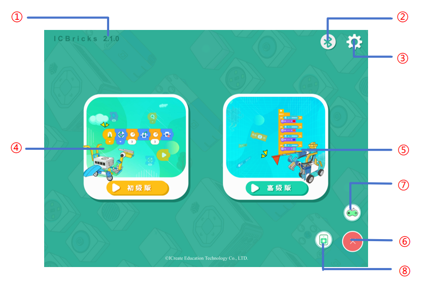
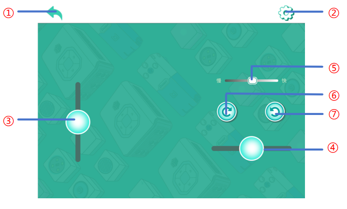
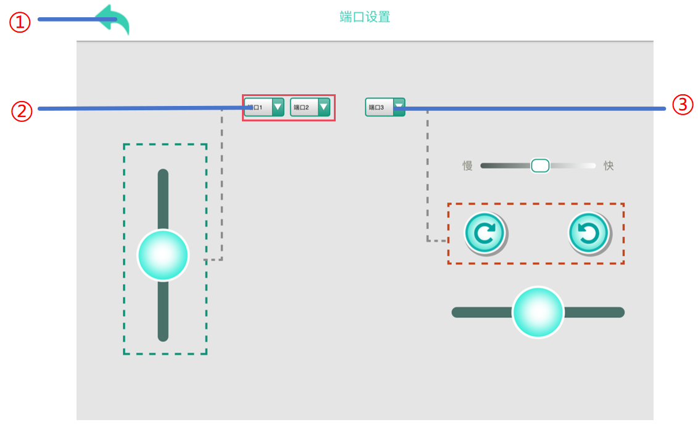
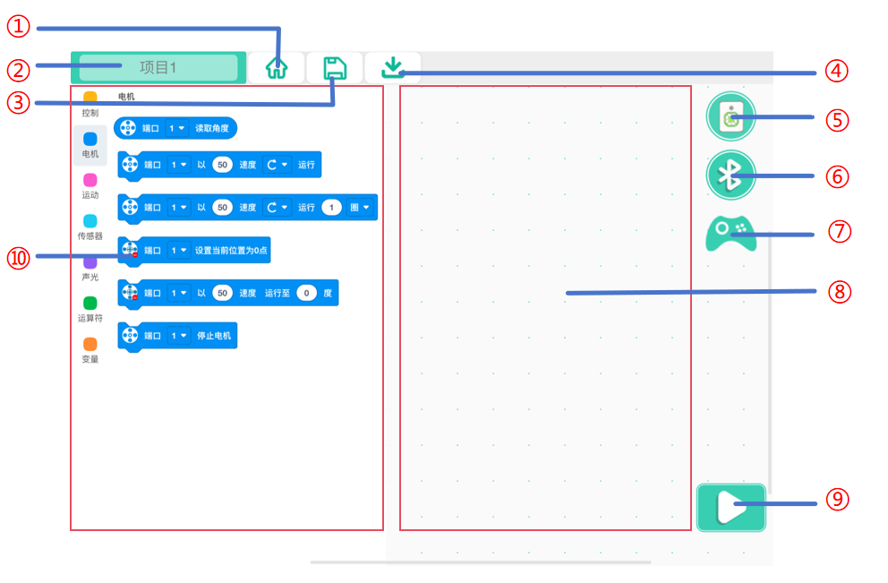

# Interface Guide
## Login Interface  

|  No.   |  Name   | Description |
| :---: | :---: | --- |
| ① | ** Version Info  ** | View the current software version.   |
| ② | **Bluetooth  ** | Tap to open the Bluetooth connection window and pair with a target device.   |
| ③ | ** Settings  ** | Tap to configure software language and other options.   |
| ④ | **Junior Version ** | Tap to select a project and enter the basic programming interface.   |
| ⑤ | **Advanced Version** | Tap to select a project and enter the advanced programming interface.   |
| ⑥ | ** Floating Ball  ** | Tap to expand the remote and console buttons; tap again to collapse it.   |
| ⑦ | ** Remote Control  ** | Tap to enter the remote control interface for robot operations.   |
| ⑧ | ** Console  ** | Tap to access the console interface to view external device statuses.   |

## Bluetooth Window  

|  No.   |  Name   | Description |
| :---: | :---: | --- |
| ① | **Refresh Devices   ** | Rescan for nearby ICBricks devices and update the device list.     |
| ② | **  Hidden Function (Bluetooth Rename)  ** | Tap the text 10 times to enter the renaming interface for Bluetooth devices.     |
| ③ | ** Close Window  ** | Close the Bluetooth window.   |
| ④ | ** Device List   ** | Display all scanned devices. Tap a device name to pair; connected devices are highlighted in green.   |
| ⑤ | **Disconnect   ** | End the Bluetooth connection with the current device. |

## Settings Interface  

|  No.   |  Name   | Description |
| :---: | :---: | --- |
| ① | ** Back  ** | Return to the login interface.   |
| ② | ** Language  ** | Change the software language.   |

## Remote Control Interface  

|  No.   |  Name   | Description |
| :---: | :---: | --- |
| ① | ** Back  ** | Return to the login interface.   |
| ② | **Settings  ** | Adjust port settings for custom remote control configurations.   |
| ③ | ** Forward/Reverse Slider  ** | Drag the slider to control the robot to move forward or back. The larger the slider drags, the faster the robot is. |
| ④ | **Left/Right Slider  ** | Drag the slider to control the robot to turn left or right. The larger the slider drags, the faster the steering speed. |
| ⑤ | **Speed Settings  ** | Adjust motor speeds for specific motion needs.     |
| ⑥ | **Clockwise Rotation** | Tap to rotate other motors clockwise; release to stop.   |
| ⑦ | **Counterclockwise Rotation  ** | Tap to rotate other motors counterclockwise; release to stop.   |

## Remote Control Settings Interface  

|  No.   |  Name   | Description |
| :---: | :---: | --- |
| ① | ** Back  ** | Return to the remote control interface.   |
| ② | ** Motor Settings  ** | Adjust ports for controlling robot movement.   |
| ③ | ** Other Motors  ** | Adjust ports for other motors.   |

## Console Interface  

|  No.   |  Name   | Description |
| :---: | :---: | --- |
| ① | ** Back  ** | Return to the login interface.   |
| ② | **Power Status  ** | Display the battery status of connected devices (range: 0-100).    |
| ③ | ** Firmware Version   ** | View the firmware version of connected devices for update checks.   |
| ④ | ** Display Area  ** | Show the status of sensors and actuators, with clickable controls for actuators.   |

## **Beginner Version **

|  No.   |  Name   | Description |
| :---: | :---: | --- |
| ① | **Back  ** | Save the current project and return to the login interface.   |
| ② | ** Console   ** | Click the console button to view the port information of the current device for easy debugging; click the button again to retrieve the console. |
| ③ | ** Bluetooth    ** | Open the Bluetooth connection window to pair with a target device.   |
| ④ | ** Remote Control   ** | Open the remote control window to assist with programming.   |
| ⑤ | ** Programming Area  ** | Drag and drop blocks to create programs.   |
| ⑥ | ** Run  ** | Start or stop the program edited in the programming area.   |
| ⑦ | ** Zoom Control    ** | Adjust the size of programming blocks for better visibility.   |
| ⑧ | ** Block Area  ** | Classified display of various functional blocks, quickly find the required sensors according to the color, convenient and efficient selection and use.   |

## Advanced Version

|  No.   |  Name   | Description |
| :---: | :---: | --- |
| ① | ** Back  ** | Save the current project and return to the login interface.     |
| ② | **Title  ** | Modify the title of the current project.   |
| ③ | **Save  ** | Save the current project.   |
| ④ | **Download  ** | Download the program to the hub.   |
| ⑤ | ** Console  ** | Click the console button to view the port information of the current device for easy debugging; click the button again to retrieve the console. |
| ⑥ | ** Bluetooth  ** | Open the Bluetooth connection window to pair with a target device.   |
| ⑦ | ** Remote Control  ** | Click the remote control button, pop up the remote control window, and assist the programming operation |
| ⑧ | **Programming Area  ** | Write the area of the program, drag and drop the building blocks to the programming area, and complete the program writing. |
| ⑨ | **Run  ** | Download the program to the hub and start execution; click again to stop  the program. |
| ⑩ | **Block Area  ** | Classified display of various functional blocks, quickly find the required sensors according to the color, convenient and efficient selection and use.   |

