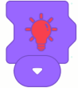

# Junior edition
## Yellow (Trigger Category)  
### When Program Starts  

When program start button is clicked, run the following building blocks

**Example**:  

 When the program starts, the motor rotates clockwise.  

### When Gyroscope Sensor ()  

Executes the following blocks when the gyroscope sensor tilts to a specified position.  

**Example**:

When the gyro sensor tilts left, the motor rotates clockwise; when it tilts right, the motor rotates counterclockwise.  

### When Gesture Sensor Detects ()

Executes the following blocks when the gesture sensor detects the specified gesture.  

**Example**:  

When the gesture sensor detects a "swipe left" gesture, the motor rotates clockwise.  

### When Encoder Sensor ()  

Executes the following blocks when the encoder sensor detects a specified action.  

Example:

When the encoder sensor rotates clockwise, the motor rotates clockwise.  

### When Sound Sensor Detectes ()

Executes the following blocks when the sound sensor detects sound levels above 80.  

Example:

When the sound sensor detects a sound, the motor rotates clockwise.  

### When Distance Sensor Detects ()  

Executes the following blocks when the distance sensor detects a specified range (close: n ≤ 5; medium: 5 < n ≤ 10; far: n > 10).  

Example:

When the distance sensor detects a close range, the motor rotates clockwise.  

### When Button () is Pressed  

Executes the following blocks when the specified button on the remote control is pressed.  

Example:

When the "Up" button is pressed, the motor rotates clockwise.  

## Blue (Motor Category)  
### Set Motor Speed to ()  

Sets the motor speed to the specified value (this block does not directly control motor movement).  

Example:

When the program starts, set the motor speed to high, and the motor rotates clockwise.  

### Motor () Rotates Clockwise  

Controls the selected port motor to rotate clockwise; if no port is selected, all ports are used by default. 

Example:

When the program starts, the motor rotates clockwise.  

### Motor () Rotates Counterclockwise  

Controls the selected port motor to rotate counterclockwise; if no port is selected, all ports are used by default.  

Example:

 When the program starts, the motor rotates counterclockwise.  

### Motor () Stops Rotating  

Stops the motor at the selected port; all ports are used by default if none are selected.  

Example:

When the "A" button is pressed, the motor rotates clockwise; when the "B" button is pressed, the motor stops.  

### Move Forward  

Controls the robot to move forward (requires two motors: left motor connected to Port 1, right motor connected to Port 2).  

Example:

When the program starts, the robot moves forward.  

### Move Backward  

Controls the robot to move backward (requires two motors: left motor connected to Port 1, right motor connected to Port 2).  

Example:

When the program starts, the robot moves backward.  

### Turn Left  

Controls the robot to turn left (requires two motors: left motor connected to Port 1, right motor connected to Port 2).  

Example:

When the program starts, the robot turns left.  

### Turn Right  

 Controls the robot to turn right (requires two motors: left motor connected to Port 1, right motor connected to Port 2).  

Example:

When the program starts, the robot turns right.  

### Stop  

Stops the robot's movement.  

Example:

When the "A" button is pressed, the robot moves forward; when the "B" button is pressed, the robot stops.  

## Purple (Lighting Category)  
### Set Touch LED Sensor to Color ()  

Sets the touch LED sensor to the selected color.  

Example:

When the program starts, the touch LED sensor lights up red.  

## Orange (Control Category)  
### Wait () Seconds  

Waits for the specified amount of time before executing the following blocks.  

Example:

When the program starts, wait 1 second, then the motor rotates clockwise.  

### Repeat () Times  

Repeats the enclosed program for the specified number of times (default is 4).  

Example:

When the program starts, wait 1 second, the motor rotates clockwise, wait 1 second again, and the motor stops. Repeat 4 times.  

### Repeat Continuously  

Continuously repeats the enclosed program.  

Example:

When the program starts, wait 1 second, the motor rotates clockwise, wait 1 second again, and the motor stops. Repeat infinitely.  

