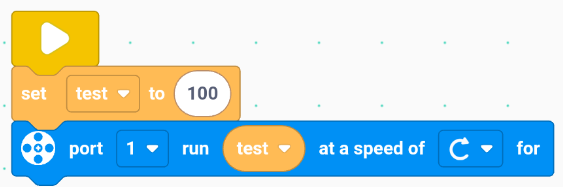

# Advanced edition
## Control
### Wait for ( ) second  / millisecond  

Execute the following program after waiting for a specified period of time. 

Example：

When the program starts, wait for 1 second, then turn the color LED module on port 1 to red.  

### Loop

Repeat the contained program.  

Example：

At program start, wait 1 second, turn the color LED on port 1 red. Wait another second, then turn it green. Repeat this cycle endlessly.  

### Repeat ( ) times  

Repeat the inner program block for a set number of times. Default is 3 times.  

Example：

When the program starts, wait 1 second, then set the color LED module on port 1 to red. Wait another 1 second, then set the color LED module on port 1 to green. Repeat this 3 times.  

###  if ( ) then ( )  

If the specified condition is true, then execute the contained program.  

Example：

On start, when a remote control button is pressed, turn the color LED on port 1 green.  

### if ( ) then ( ) else ( )  

If the specified condition is true, execute the contained program 1; otherwise, execute program 2.  

Example：

On start, if the remote control button is pressed, turn the color LED on port 1 green; else turn it red.  

### Exit loop  

Example：

On start, turn the color LED on port 1 blue. When the remote control button is pressed, turn it red.  

### Exit the program

 Example：

On start, turn the color LED on port 1 blue. When the remote control button is pressed, stop all programs.  

## Motor
### Read the angle of the servo motor on port ( ).  

Read the angle of the servo motor on the selected port.  

Example：

On start, run servo motor on port 1 clockwise at speed 50. If servo angle on port 1 > 360, stop all programs.  

### Run the servo motor on port ( ) at speed ( ) in ( ) direction.  

Run the servo motor on the selected port at the specified speed and direction.  

Example：

On start, run servo motor on port 1 clockwise at speed 50.  

### Run the servo motor on port ( ) at speed ( ) in ( ) direction for ( ) (revolutions/degrees/seconds).  

Run the servo motor on the selected port at the specified speed, direction, and unit.  

Example：

On start, run servo motor on port 1 clockwise at speed 50 for 1 rotation.  

### Set the current position of the servo motor on port ( ) to zero.  
Set the current position of the servo motor on the selected port to zero. This helps initialize the position for accurate control later.    

Example：

On start, set servo motor position on port 1 to zero, then run at speed 50 to 180°.  

### Run the servo motor on port ( ) at speed ( ) to ( ) degrees.  

Run the servo motor on the selected port at the specified speed to the target position, achieving precise positioning of the servo motor.  

Example：

On start, run servo motor on port 1 at speed 50 to 180°. Wait 1 second, then run at speed 50 to 0°.  

### Stop the servo motor on port ( ).  

Stop the servo motor on the selected port.  

Example：

On start, run servo motor on port 1 forward at speed 50. Wait 1 second, then stop it.

## Motion
### Set the running motor to ( ) and ( ).  

Set the running motor port(s). (Set dual motors)  

Example：

On start, run servo motors on ports 1 and 2 forward at speed 50.  

### Move ( ) running at ( ).  

Run the motors (default ports 1 and 2) at the specified speed and direction.

Example：

When the program starts, run the servo motors on ports 1 and 2 forward at speed 50.  

### Move ( ) running at ( ) for ( ) (rotation/degree/second).  

Run the motors (default ports 1 and 2) at the specified speed, direction, and unit.  

Example：

When the program starts, run the servo motors on ports 1 and 2 forward at speed 50 for 1 rotation.  

### Stop the motor on ( ).  

Stop the motors on default ports 1 and 2.  

Example：

On start, run servo motors on ports 1 and 2 forward at speed 50. Wait 1 second, then stop them.  

## Sensor
### Port ( ) compare distance to ( ).  

Check if the distance sensor value on specified port meets the condition compared to a given value.  

Example：

On start, if distance sensor on port 1 < 10, touch color LED on port 2 lights red; else lights green.  

### Port ( ) compare Sound to ( ).  

Check if sound sensor value on specified port meets a given condition compared to another value.  

Example：

On start, if sound sensor value on port 1 > 50, touch color LED on port 2 lights red; else lights green.  

### Port（）Encoder（）

Check whether the encoder sensor on the specified port is performing the specified motion.  

Example：

On start, if encoder sensor on port 1 rotates counterclockwise, touch color LED on port 2 lights red; else lights green.  

### Port（）Gyroscope Sensor（）

Check whether the gyroscope sensor on the specified port is performing the specified motion.  

Example：

On start, if the gyroscope sensor on port 1 tilts forward, touch color LED on port 2 lights red; else lights green.  

### Port（）Gesture Sensor（）

Check whether the gesture recognition sensor on the specified port is performing the specified gesture.

Example：

On start, if the gesture sensor on port 1 detects swipe up, touch color LED on port 2 lights red; else lights green.  

### Button ( ) on main controller is pressed.  

Check if the specified button on the main controller is pressed.  

Example：

On start, if main controller button pressed, touch color LED on port 2 lights red; else lights green.  

### Button ( ) on remote control is pressed.  

Check if the specified button on the remote control is pressed.  

Example：

When the program starts, the touch color LED module on port 2 lights up red only when a button on the remote control is pressed; otherwise, it lights up green.  

### Port（）Axis（）

Detect the tilting value of the gyroscope sensor on the specified port along the specified axis.  

示例：

When the program starts, the touch color LED module on port 2 lights up red only when the value of tilting the gyroscope sensor on port 1 around the X-axis is greater than 40; otherwise, it lights up green.  

### Port（）Encoder

Detect the value of the encoder sensor on the specified port.

Example：

When the program starts, the touch color LED module on port 2 lights up red only when the value detected by the encoder sensor on port 1 is greater than 100; otherwise, it lights up green.  

### Port（）Distance

Detect the value of the distance sensor on the specified port.  

Example：

When the program starts, the touch color LED module on port 2 lights up red only when the distance detected by the distance sensor on port 1 is greater than 10; otherwise, it lights up green.  

### Port（）Sound

Detect the value of the sound sensor on the specified port.  

Example：

When the program starts, the touch color LED module on port 2 lights up red only when the value detected by the sound sensor on port 1 is greater than 50; otherwise, it lights up green.  

## Light
### Touch LED Module Port（）is（）

Control the touch color LED module on the specified port to display the lighting effect in the specified color.   

Example：

When the program starts, the touch color LED module on port 1 lights up red.  

### Indicator Position（）is（）

Control the indicator light of the main controller at the specified location to display the lighting effect in the specified color.   

Example：

When the program starts, the indicator light of the main controller at the top-left corner lights up red.  

## Operator
### （）+（）

Perform addition operation.  

Example：

When the program starts, the servo motor on port 1 runs clockwise at a speed equal to the result of (30 + 20).  

### （）-（）

Perform subtraction operation.  

Example：

When the program starts, the servo motor on port 1 runs clockwise at a speed equal to the result of (100 - 50).  

### （）*（）

Perform multiplication operation.  

Example：

When the program starts, the servo motor on port 1 runs clockwise at a speed equal to the result of (25 * 2).  

### （）/（）

Perform division operation.  

Example：

When the program starts, the servo motor on port 1 runs clockwise at a speed equal to the result of (200 ÷ 4).  

### （）>（）

Determine whether the value of a specified parameter is greater than another specified value.  

Example：

When the program starts, the touch color LED module on port 2 lights up red only when the value detected by the sound sensor on port 1 is greater than 50; otherwise, it lights up green.

### （）<（）

Determine whether the value of a specified parameter is less than another specified value.  

Example：

When the program starts, the touch color LED module on port 2 lights up red only when the distance detected by the distance sensor on port 1 is less than 20; otherwise, it lights up green.  

### （）=（）

Determine whether the value of a specified parameter is equal to another specified value.  

Example：

When the program starts, the touch color LED module on port 2 lights up red only when the value detected by the encoder sensor on port 1 is equal to 0; otherwise, it lights up green.  

### （）and（）

Determine whether the two specified conditions are both true.  

Example：

When the program starts, the touch color LED module on port 2 lights up red only when the tilt sensor on port 1 detects a forward tilt and the tilt sensor on port 3 detects a backward tilt; otherwise, it lights up green.  

### （）or（）

Determine whether at least one of the two specified conditions is true.  

Example：

When the program starts, the touch color LED module on port 2 lights up red only when the tilt sensor on port 1 detects a forward tilt or the tilt sensor on port 3 detects a backward tilt; otherwise, it lights up green.  

###   not（）

Determine whether the specified condition is not true.  

Example：

When the program starts, the touch color LED module on port 2 lights up red only when the tilt sensor on port 1 does not detect a forward tilt; otherwise, it lights up green.  

###  Generate a random number between ( ) and ( )

Generate a random number within the specified range.  

Example：

When the program starts, the servo motor on port 1 runs clockwise at a speed of 50 and stops after running for a random number of seconds between 1 and 10.  

##  Variable
### Create a variable.  
Create a variable to use in the program. Notice that no operation blocks except the "Create variable" itself will appear in the "variable" category unless at least one variable has been created first. In other words, creating a variable is always the first step before using any variable-related functions. In this case, I created the variable named "test".

### Assign（）to（）

Set the variable to the specified number.  Notice that the input field comes from the "operator" category. 

Example：

When the program starts, the variable "test" is set to 100.  

###  Change / Increase () by ()

Increase the variable by the specified number.  

Example：

When the program starts, the variable "test" is set to 100, then after waiting for 1 second, the variable "test" is increased by 20.  Notice that the input field also accepts negative numbers, which represent a decrease.  

### Variable name

The name you set for your variable — here, I set the variable name as "test".  

Example：

When the program starts, the variable "test" is set to 100, and the servo motor on port 1 runs clockwise at the speed of variable "test".  

