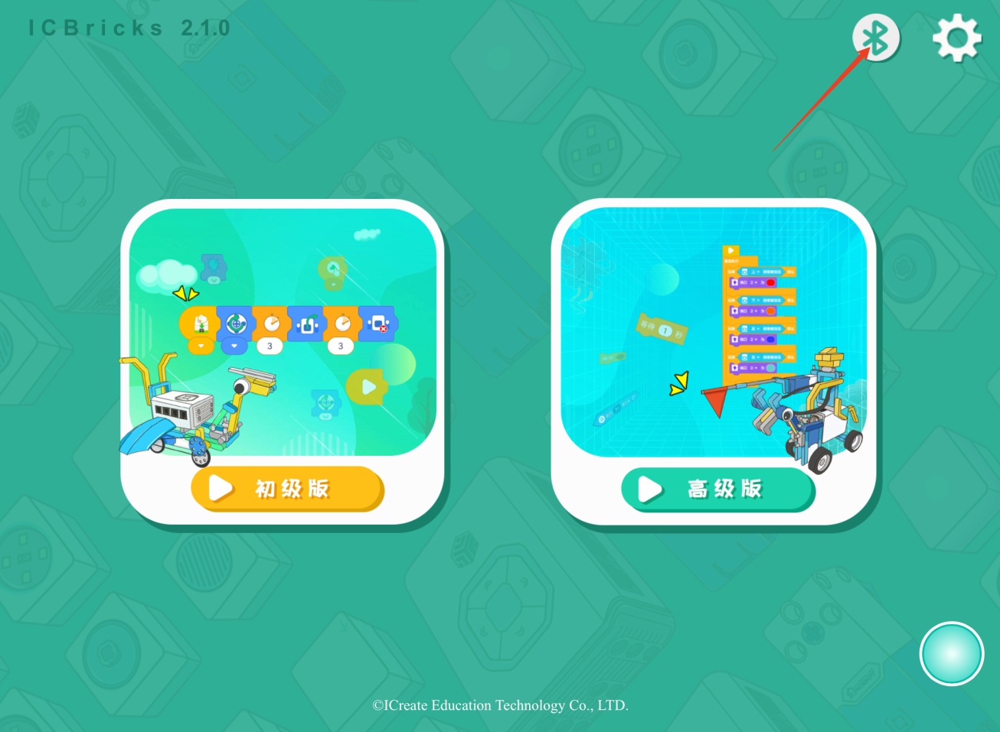
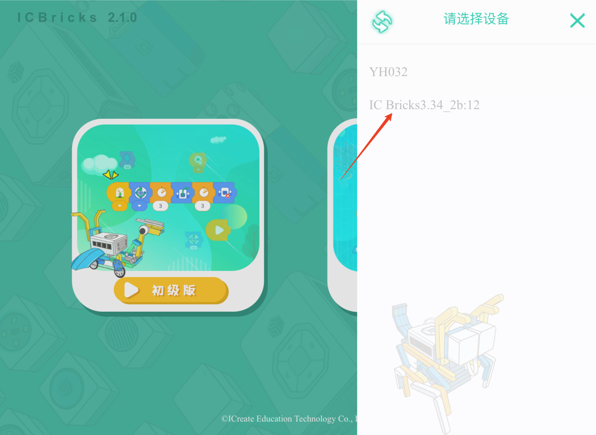
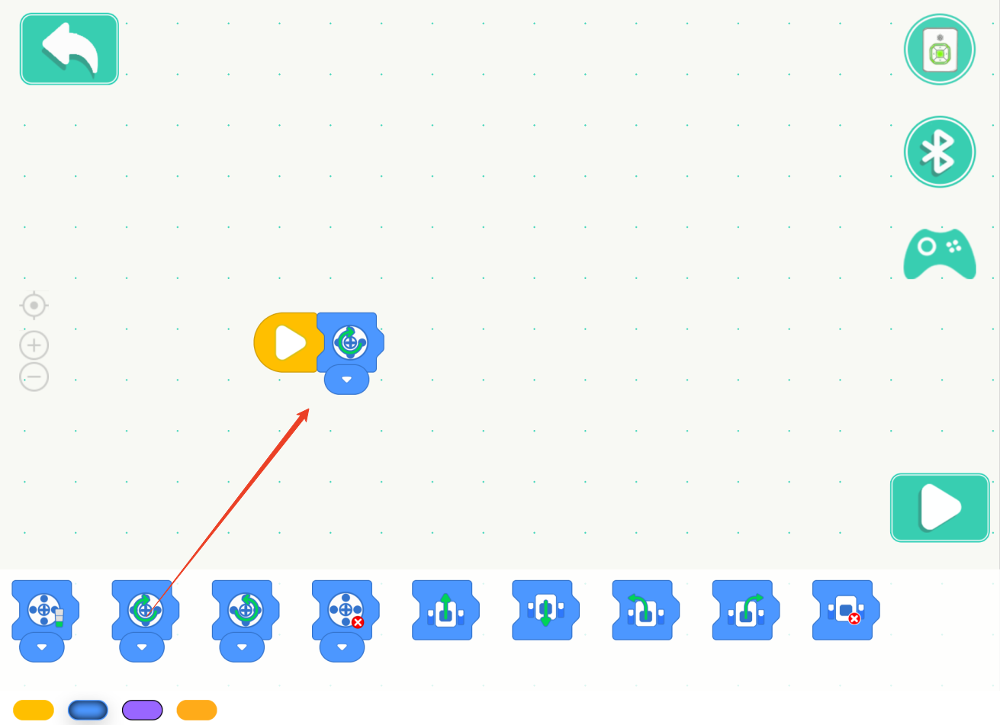
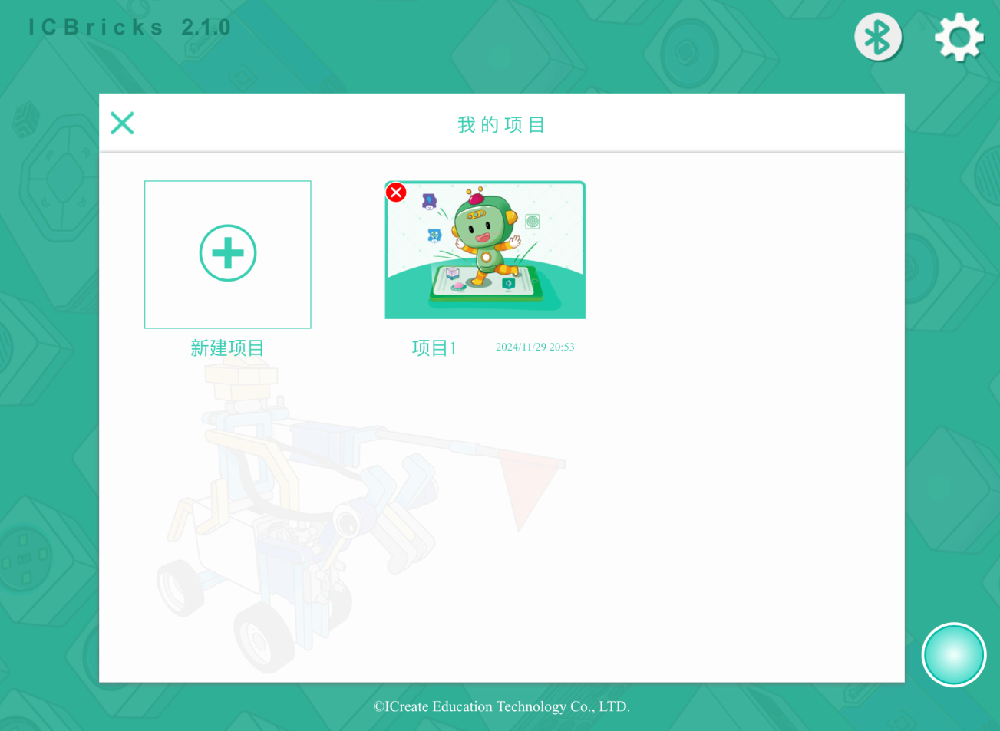
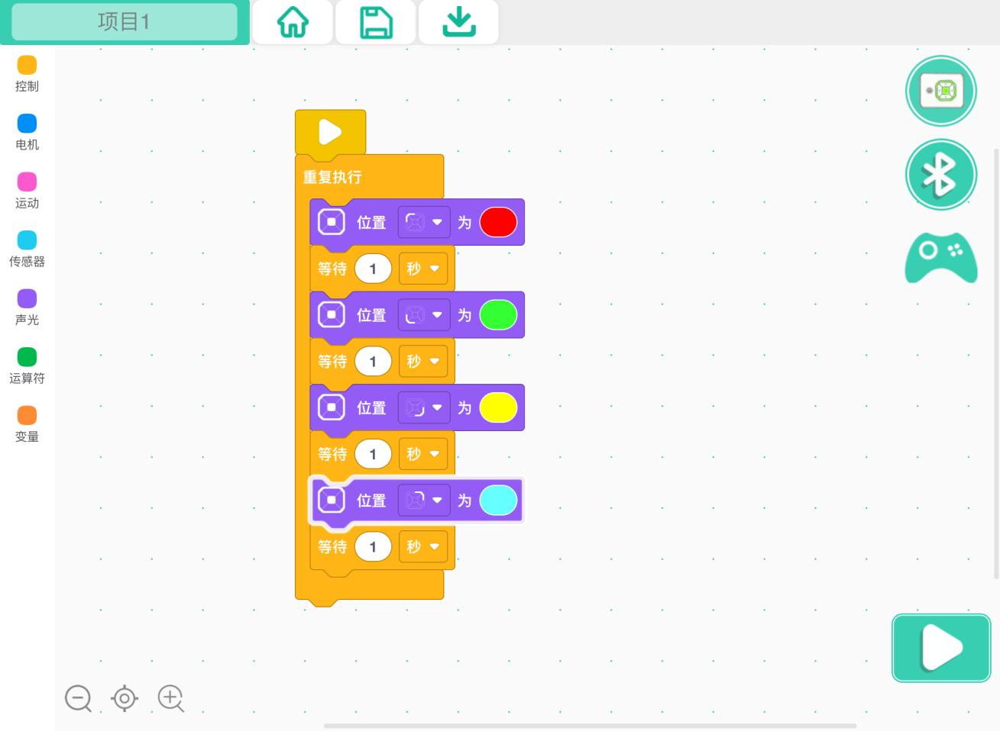
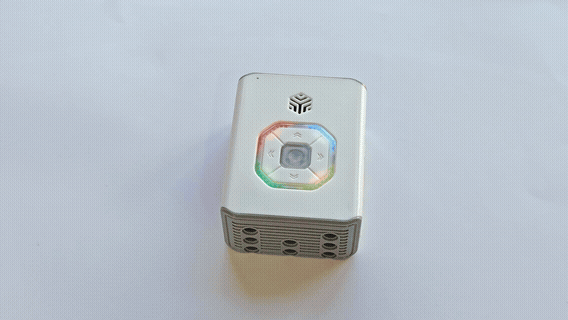

# User Guide
## Required Permissions
The mobile app does not involve a registration process, nor does it upload any of your personal information to servers. During usage, you only need to grant the following device permissions to ensure the proper functioning of related features:  

**Storage  **

Purpose: To save and read programming projects.

Special Note: Your programming projects are stored locally on your device and will not be accessed or uploaded.

**Bluetooth  **

Purpose: To connect to hardware devices and enable interactive operations with hardware.

Special Note: During Bluetooth communication, data is transmitted only between your device and the hardware. Communication content is neither recorded nor disclosed.

**Location  **

Purpose: To scan BLE (Bluetooth Low Energy) devices, as required by technical specifications.

Special Note: The app does not collect location information; this permission is solely for Bluetooth scanning purposes.

## Connecting Devices  
Using Bluetooth 4.0, you can easily connect your device to the main controller to unlock a variety of functions:  

+ **Beginner Version:** Supports running programs directly in online mode.
+ **Advanced Version:** Allows uploading programs to devices for offline operation.

### Connection Steps:  
1. **Power On the Device:** Press the device's power button to start.  
2. **Enable Bluetooth and Location Services:** Ensure Bluetooth and location services are active to support Bluetooth Low Energy mode.  

3. **Open the Programming Software:** Tap the Bluetooth button to initiate the device connection.  

4. **Select the Device:** If multiple devices are detected, choose the target device from the dropdown menu.  

5. **Complete the Connection:** Once connected, the target device will display a green background with a "Disconnect" button. The Bluetooth connection status will remain active within the app, eliminating the need for frequent reconnections.  

## Creating a Project  
1. **Choose Beginner Mode:** Select the basic programming mode for a quick start.  

2. **Click "New Project":** Create a brand-new project.  

3. **Edit the Program:** Drag and drop blocks to write your program.  

4. **Exit and Save:** Tap the back button to automatically save your program. You’ll return to the main interface to view your project list.  

## Online Mode (**Beginner Version)**
1. **Write a Program:** Enter the basic programming interface to create your program.  

2. **Click the Run Button:** The program will run on the device in real-time. Note that the program stops running if the Bluetooth connection is interrupted.  

## Offline Mode (Advanced Version):  
1. **Write a Program:** Enter the advanced programming interface to design more complex logic.  

2. **Click the Run Button:** The program is downloaded to the device and starts immediately. It continues running even if the Bluetooth connection is lost.  

3. **Click the Download Button:** The program is downloaded to the device but does not execute immediately. You can run it later, even without a Bluetooth connection.  

4. **Start a Downloaded Program:** Press the device's power button three times in quick succession to run the downloaded program. Note that the Bluetooth connection will be interrupted, and the device cannot reconnect while the program is running.  

5. **Quickly Stop a Running Program:** While the program is running, press the power button three times in quick succession to stop it.  

## Renaming the Bluetooth Device  
|  |  |
| --- | --- |
| 1. **Connect the Device:** Tap the Bluetooth button, select the target device in the list, and connect. The hub's breathing light will flash white to indicate a successful connection.     | 2. **Access the Rename Option:** Tap "Select Device" 10 times in a row to bring up the rename input box.    |
|  |  |
| 3. **Enter a New Name:** Input the new name in the box. A confirmation window will appear upon a successful name change.   | 4. **Reconnect to View the New Name:** Disconnect the Bluetooth connection, refresh the device list, and reconnect to see the updated device name.   |

