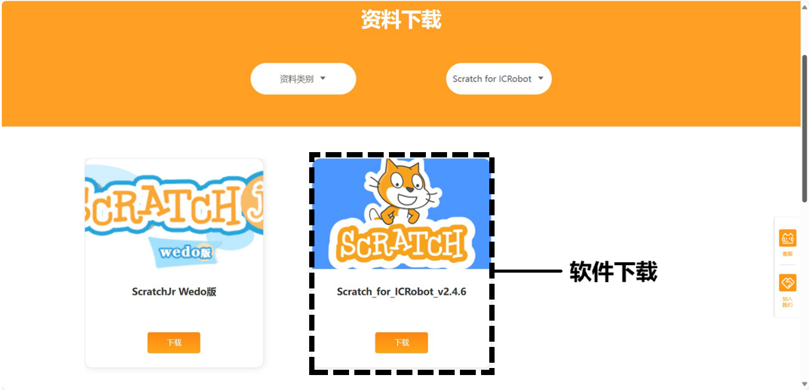
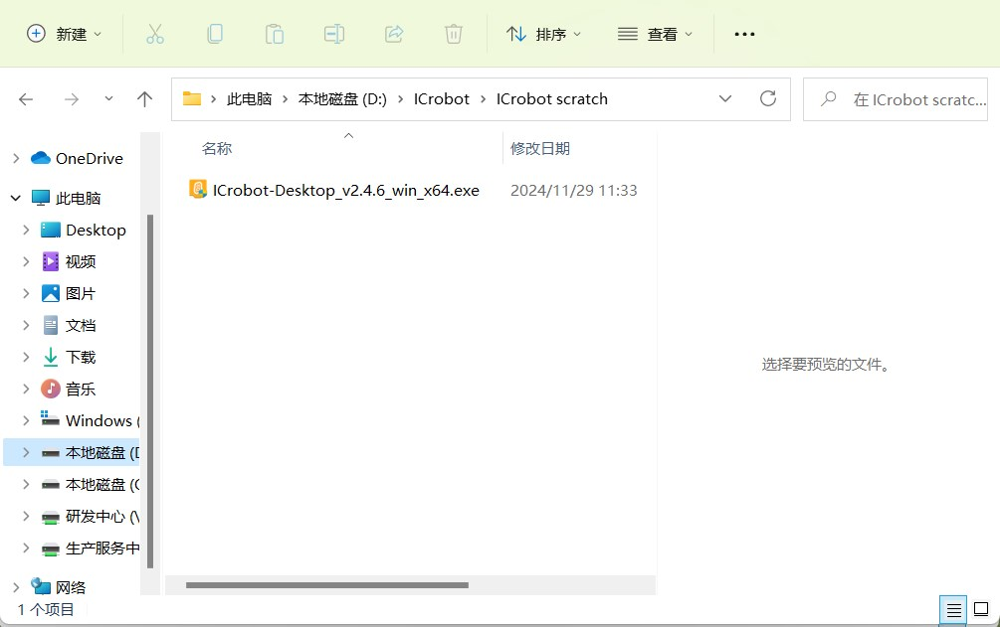
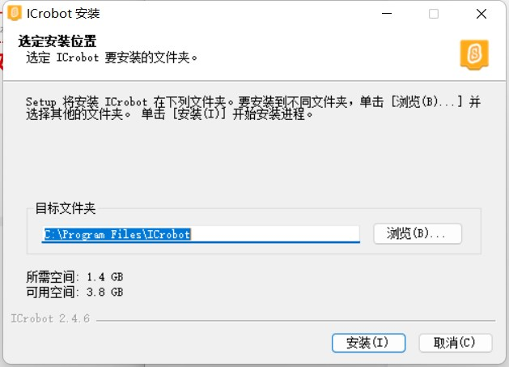
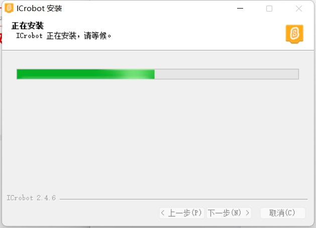
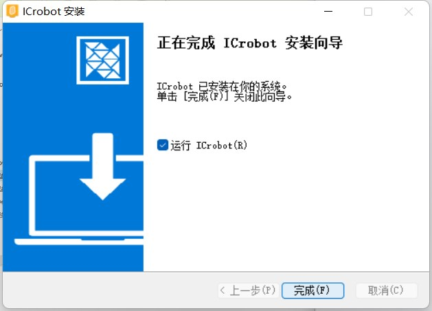
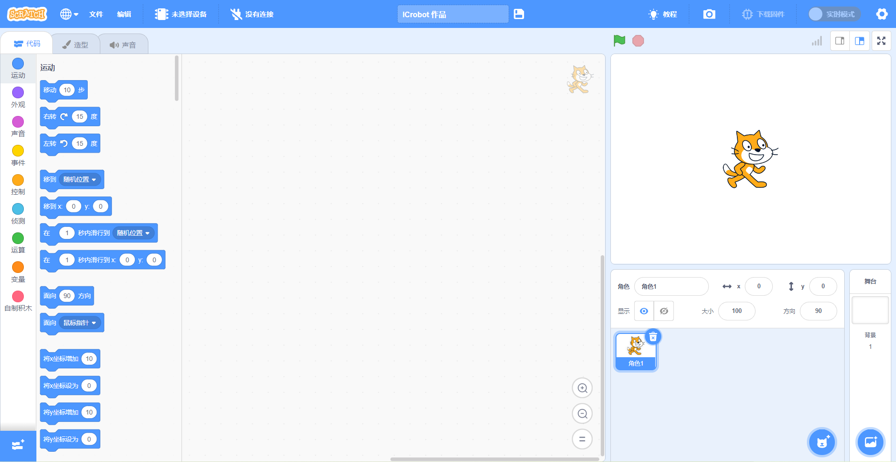

# Software Installation
## System Requirements  
ICrobot-Scratch coding software supports 64-bit Windows operating systems.  

## Quick Installation  
### Download  
Click to download [ICrobot-Scratch](https://www.icrobot.com/www/cn-mobile/index.html#/file/index?type2=Scratch%20for%20ICRobot) and save the coding software to your computer.  

### Windows System Installation Steps  
Double-click the installation file and follow the installation wizard to correctly install ICrobot Scratch coding software. The steps are as follows:  

|   |
| :---: |
| Step 1: Select and double-click the installation file   |
|   |
|  Step 2: Choose the software installation directory. It is recommended to select a disk other than the C drive (system disk)!   |
|   |
|  Step 3: Wait for the installation to complete. The time required will depend on the performance of your computer, so please be patient.   |
|   |
|  Step 4: Click “Run” and then “Finish.” The ICrobot-Scratch coding software is installed and will open.   |
|  |
|  Step 5: Once the coding software opens, you will enter the coding interface.   |

