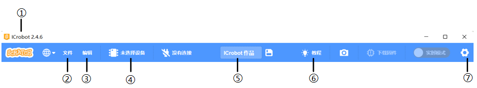
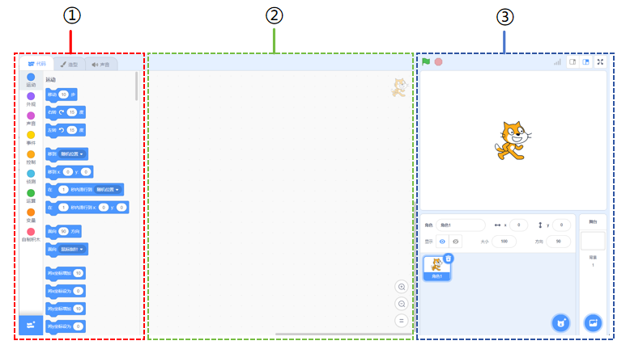

# Interface Guide
## Toolbar  

|  No.   | Name   | Function   |
| :---: | :---: | --- |
| ① |  Version   | The coding software version number is displayed here.   |
| ② |  File   | Click the File button to create a new project, open an existing project, save a project, or import a project from your computer.   |
| ③ | Edit   | Used to restore deleted characters while coding.   |
| ④ |  Device Connection   | Click this button to select and connect devices through the COM port.   |
| ⑤ | Project Name   | Allows you to change the project name and save the project.   |
| ⑥ |  Tutorial   | Click to view the quick-start video demonstration of the software.   |
| ⑦ |  Settings   | Check for updates, clear cache, view version information, and manage license details.   |

## Editing Interface  

| No.   | Name   | Function   |
| :---: | :---: | --- |
| ① | Block Instruction Area   | The block instructions are color-coded to differentiate between various types, making it easier to find.   |
| ② |  Coding Area   | Drag and drop block instructions into this area to perform coding operations.   |
| ③ |  Stage Area   | Add characters, backgrounds, and display functions.   |

