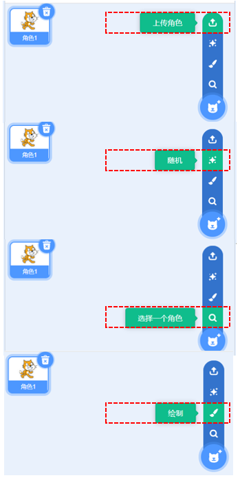
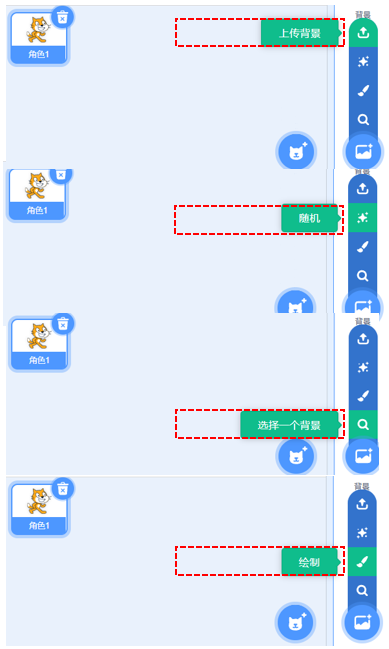
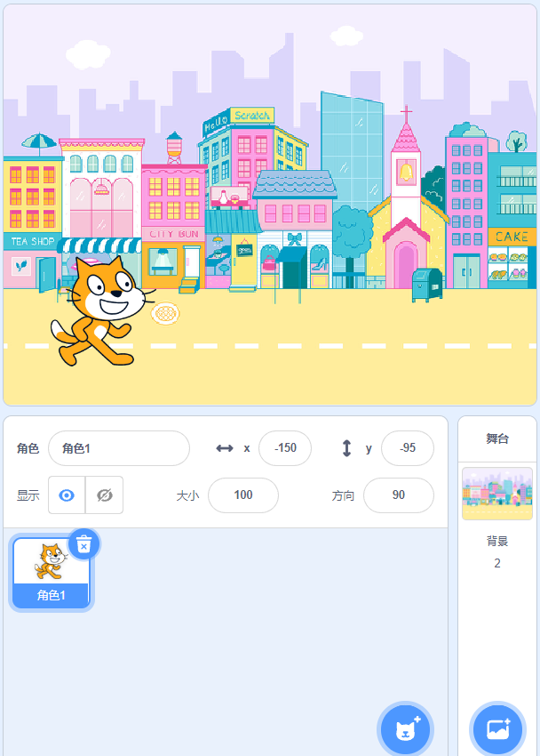
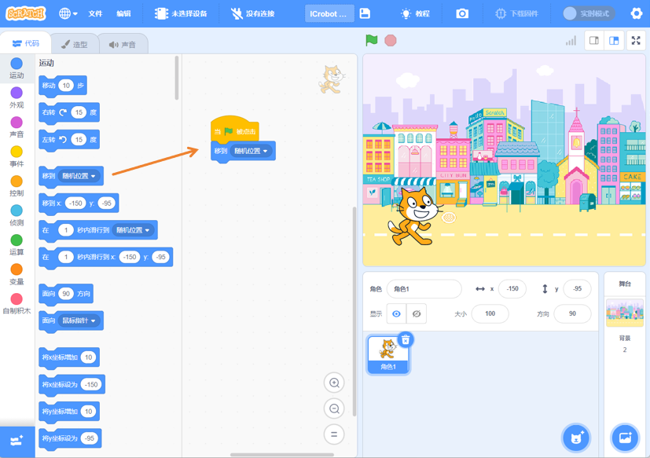

# Drawing the Stage
## Adding Characters  
|  |  |  |
| --- | --- | --- |
| Step 1: The default character is CAT.   | Step 2: Add a new character by clicking to select a character.   | Step 3: There are four ways to choose a character: upload a character from your local device, randomly use a built-in character, select a built-in character, or manually draw a character.   |

## Adding Background  
|   |   |   |
| --- | --- | --- |
| Step 1: The default background is blank.   | Step 2: Add a background by clicking to select a background.   | Step 3: There are four ways to add a background: upload a background from your local device, randomly use a built-in background, select a built-in background, or manually draw a background.   |

## Making Characters Move  
### Example:  
After adding a background and character, the character can move randomly when the green flag is clicked.  

|  |  |
| :---: | :---: |
| Step 1: Add a background and character.   | Step 2: In the "Events" commands, choose "When the green flag is clicked."  。 |
|  |  |
|  Step 3: In the "Motion" commands, choose "Move to a random position."   | Step 4: Click the green flag to start the program.   |

### Effect Demonstration  

