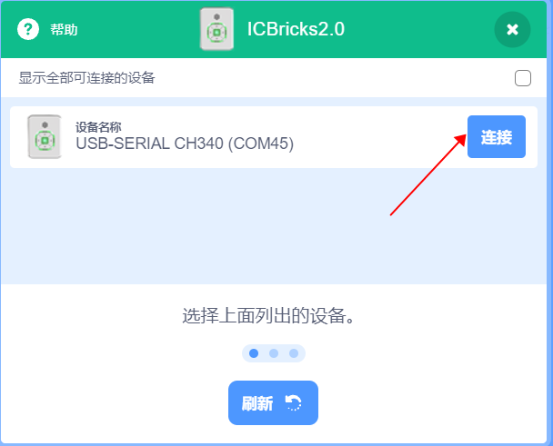
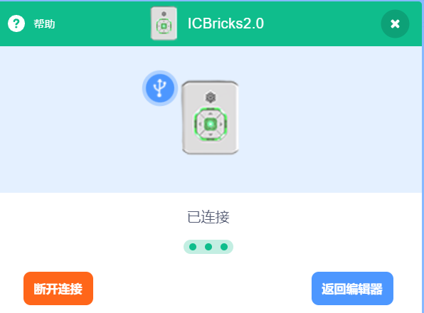
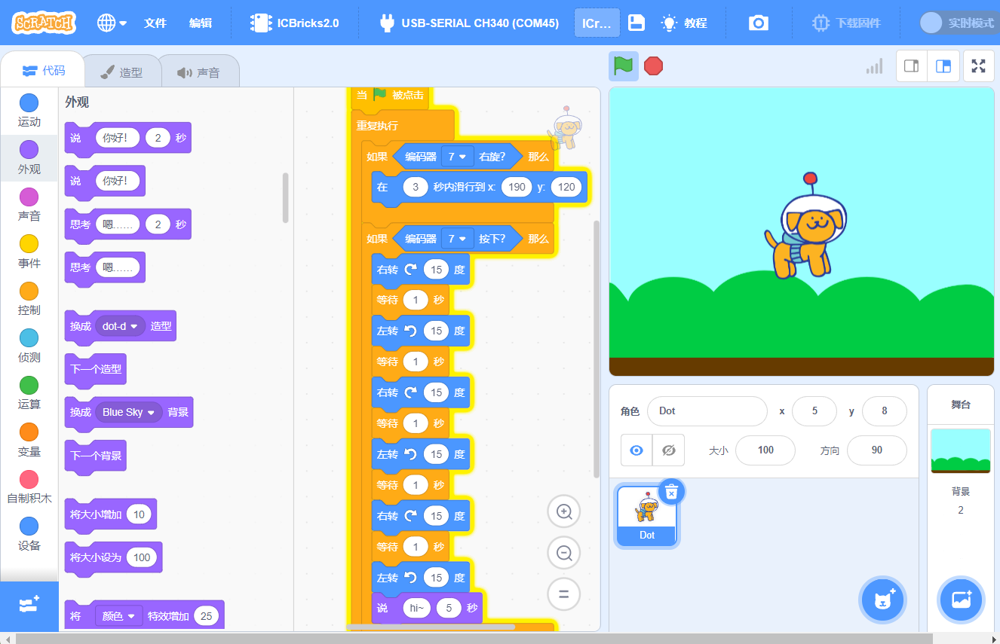

# Connecting Hardware Devices
## Connecting Hardware Devices  
|  |  |
| --- | --- |
| Step 1: Connect the ICBricks hub, USB-C data cable, and the PC COM port as shown in the diagram.   | Step 2: Click on "No device selected" in the navigation bar to connect the device.   |
|  |  |
| Step 3: Select and click on ICBricks 2.0.   | Step 4: Choose the correct COM port and click "Connect."   |
|  |  |
| Step 5: Click "Return to Editor" to enter the coding interface.   |  |

## Coding Hardware Devices  
### Example:  
Control the character to perform various movements by changing the different states of the encoder.  

### Coding Content  

### Effect Demonstration  
|  |  |
| --- | --- |

