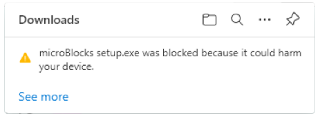
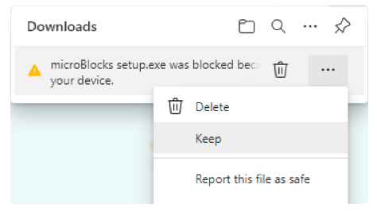
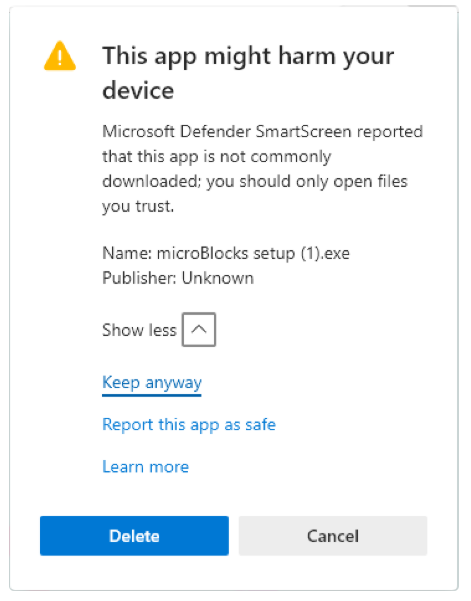
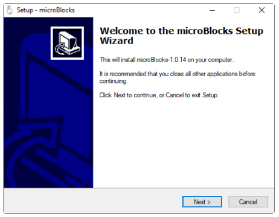
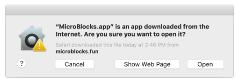

# Software Installation
## Running MicroBlocks  
### Browser (Recommended)  
No installation required. Simply run [MicroBlocks](https://microblocksfun.cn/v1-icbricks/) directly in Chrome or Edge browsers.  

MicroBlocks can also run in other browsers, but it can only connect with the motherboard when running in Chrome or Edge browsers on desktop or laptop computers (not mobile devices).

### Windows
Click "[Download.](https://microblocks.fun/downloads/latest/packages/microBlocks%20setup.exe)" In Chrome or Edge browsers, a warning will appear stating that the downloaded file might harm your computer.  

<!-- 这是一张图片，ocr 内容为： -->

Click the menu and select "Keep."  

<!-- 这是一张图片，ocr 内容为： -->

Another warning will pop up, click "Show More," and select "Keep anyway."  

<!-- 这是一张图片，ocr 内容为： -->

Open the saved file, microBlocks setup.exe.  

The installation program will launch, and another warning will appear.  

<!-- 这是一张图片，ocr 内容为： -->

Click "Next" several times to complete the installation.  

Once the installation is complete, MicroBlocks will start. A shortcut icon will also be added to the desktop for easy access to MicroBlocks in the future.  

### macOS
Click "[Download.](https://microblocks.fun/downloads/latest/packages/MicroBlocks.app.zip)" After downloading, open the "Downloads" folder on your computer. Double-click MicroBlocks.app.zip to extract it.  

Right-click on MicroBlocks.app and select "Open." A dialog will pop up informing you that the app cannot be opened.  

<!-- 这是一张图片，ocr 内容为： -->

#### Troubleshooting  
If you cannot open MicroBlocks.app, open "System Preferences" from the Apple menu, then choose "Security & Privacy." In the "General" tab, make sure "Allow apps downloaded from" is set to "App Store and identified developers."  

## Download Extension  
Click the[ link](https://icreate-help-center.yuque.com/dxifg8/slsumh/tgp088u1nyo3fsm8) to download. After downloading, you will need to extract the file.  

