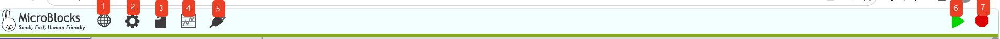
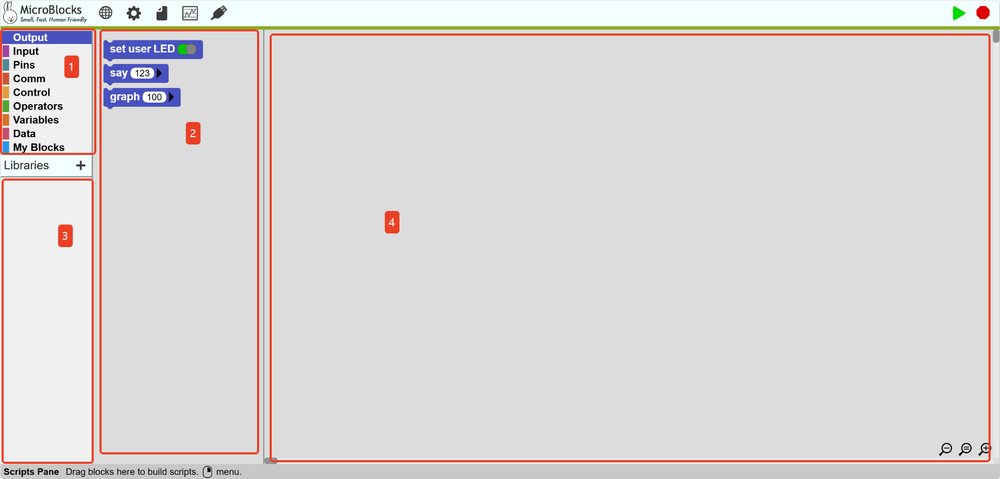

# Interface Guide
## Toolbar  
<!-- 这是一张图片，ocr 内容为： -->

| No.  | Name   | Function   |
| :---: | :---: | --- |
| ① | Language   | Click to switch languages.   |
| ② |  Settings   | Click to upgrade the motherboard firmware and display advanced blocks, among other settings.   |
| ③ | File   | Click to create a new project, open an existing project, open from the motherboard, copy project URL, and other operations.   |
| ④ | Chart   | Click to open the data chart window.   |
| ⑤ | Connection   | Click to connect to the motherboard, supporting both serial and wireless connections.   |
| ⑥ | Start   | Start running the program.   |
| ⑦ | Stop   | Stop running the program.   |

## Editing Interface  
<!-- 这是一张图片，ocr 内容为： -->

|  No. | Name | Function   |
| :---: | :---: | --- |
| ① | Block Categories   |  Click to display blocks in this category.   |
| ② | Block Area   | Drag blocks from here to build scripts. Blocks can be deleted by dragging them here.   |
| ③ | Block Library   | Click to display blocks in the block library.   |
| ④ | Script Area   | Drag blocks here to build scripts.   |

