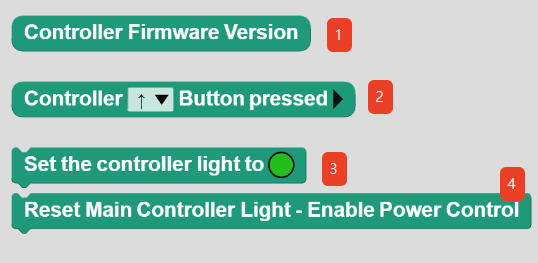
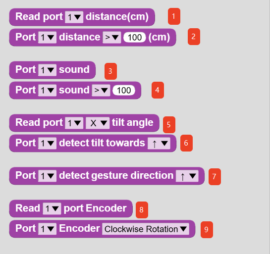
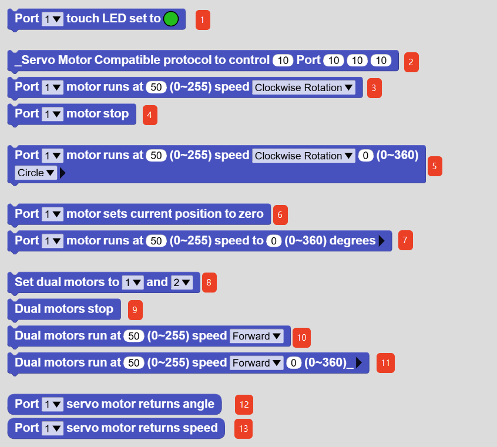

#Block Command Instructions
## Controller
<!-- 这是一张图片，ocr 内容为： -->

| No. | Name |  Description |
| :---: | :---: | :---: |
| ① | Controller Firmware Version | Gets the firmware version of the controller. |
| ② | Controller（）Button pressed | Checks whether the specified button on the controller is pressed. |
| ③ | Set the controller light to（） | Sets the controller status LED to display the specified lighting effect.   |
| ④ | Reset Main Controller Light-Enable Power Control | Displays the current battery level using the controller status LED. |

## Sensor
<!-- 这是一张图片，ocr 内容为： -->

| No. | Name |  Description |
| :---: | :---: | :---: |
| ① | Read port ( ) distance(cm) | Gets the distance value measured by the Distance Sensor connected to the specified port.   |
| ② | Port ( ) distance  ( ) 100 (cm) | Checks whether the distance value measured by the Distance Sensor connected to the specified port satisfies the specified condition.   |
| ③ | Port  ( )  sound | Gets the sound value measured by the Sound Sensor connected to the specified port.   |
| ④ | Port  ( )  sound  ( )  100 | Checks whether the sound value measured by the Sound Sensor connected to the specified port satisfies the specified condition.   |
| ⑤ | Read port  ( )  ( )  tilt angle | Gets the gyroscope reading on the specified axis from the Gyroscope Sensor connected to the specified port. |
| ⑥ | Port  ( )  detect tilt towards  ( )  | Checks whether the Gyroscope Sensor connected to the specified port detects the specified motion.   |
| ⑦ | Port  ( )  detect gesture direction  ( )  | Checks whether the Gesture Sensor connected to the specified port detects the specified gesture.   |
| ⑧ | Read  ( )  port Encoder | Gets the encoder value measured by the Encoder Sensor connected to the specified port.   |
| ⑨ | Port  ( )  Encoder  ( )  | Checks whether the Encoder Sensor connected to the specified port detects the specified motion.   |

## Actuator
<!-- 这是一张图片，ocr 内容为： -->

| No. | Name |  Description |
| :---: | :---: | :---: |
| ① | Port ( ) touch LED set to ⚫ | Controls the Touch RGB LED module connected to the specified port to display the specified lighting effect.   |
| ② | _Servo Motor Compatible protocol to control ( ) Port ( ) ( ) ( ) |  Low-level function. This function could not be hidden. Please ignore it.   |
| ③ | Port ( ) motor runs at ( ) (0~255) speed ( ) | Controls the servo motor connected to the specified port to run at the specified speed and direction.   |
| ④ | Port ( ) motor stop | Stops the servo motor connected to the specified port.   |
| ⑤ | Port ( ) motor runs at ( )  (0~255) speed  ( )  ( ) (0~360)( ) Do not wait for completion | Controls the servo motor connected to the specified port to run at the specified speed, direction, and distance unit.   |
| ⑥ | Port ( ) motor sets current position to zero | Resets the current position of the servo motor connected to the specified port to the zero position. This function can be used to initialize the servo motor position for precise motion control.    |
| ⑦ | Port  ( ) motor runs at ( )(0~255) speed to ( ) (0~360) degrees Do not wait for completion | Controls the servo motor connected to the specified port to move to the target position at the specified speed for precise positioning.     |
| ⑧ | Set dual motors to ( ) and ( ) | Sets the motor ports for dual-motor operation.   |
| ⑨ | Dual motors stop | Stops both motors.   |
| ⑩ | Dual motors run at ( )(0~255) speed ( ) | Controls both motors to run at the specified speed and direction.   |
| ⑪ | Dual motors run at ( )(0~255) speed ( ) ( ) (0~360) _( ) Do not wait for completion | Controls both motors to run at the specified speed, direction, and distance unit.   |
| ⑫ | Port ( ) servo motor returns angle | Gets the angle of the servo motor connected to the specified port.   |
| ⑬ | Port ( ) servo motor returns speed | Gets the speed of the servo motor connected to the specified port.   |

