# User Guide
## Adding Extensions  
1. Click the "Block Library" button.  

<!-- 这是一张图片，ocr 内容为： -->
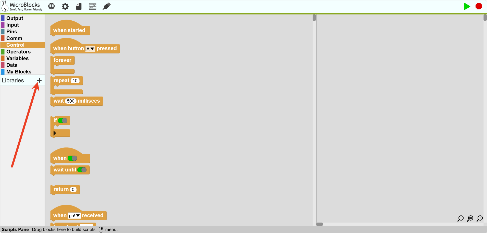

2.  Select import from "Computer."  

<!-- 这是一张图片，ocr 内容为： -->
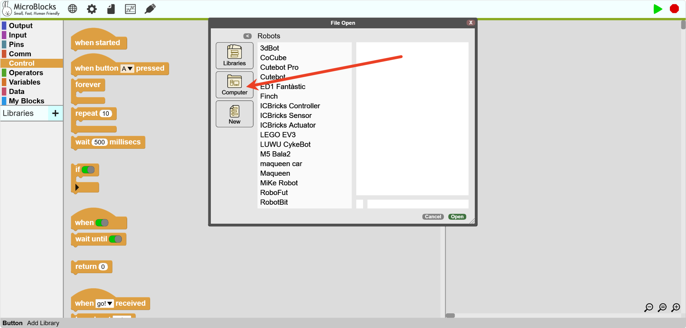

3. Add extension files one by one.  

<!-- 这是一张图片，ocr 内容为： -->
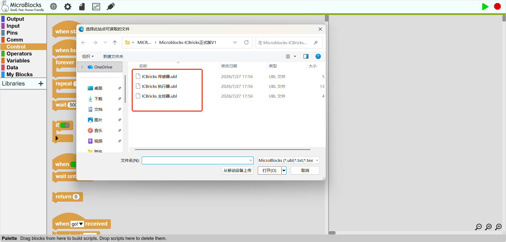

4. Once added successfully, the extension block library will appear in the block library area.  

<!-- 这是一张图片，ocr 内容为： -->
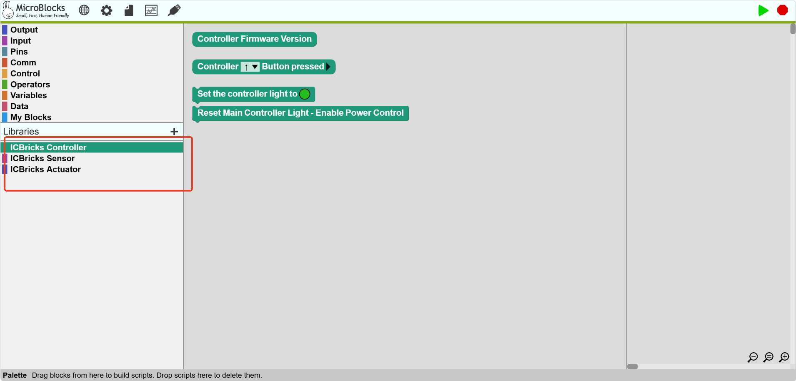

## Setting Up the Motherboard  
1. Use a USB data cable to connect the hub to the computer.  
2. In the top menu bar, click the settings button (⚙️ icon) and select "Upgrade Board Firmware."  

<!-- 这是一张图片，ocr 内容为： -->
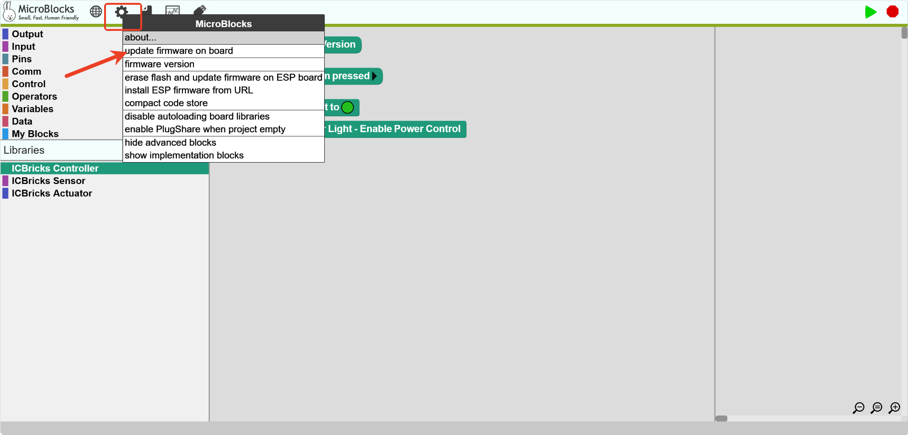

3. Select the board type: ICBricks VM.  

<!-- 这是一张图片，ocr 内容为： -->
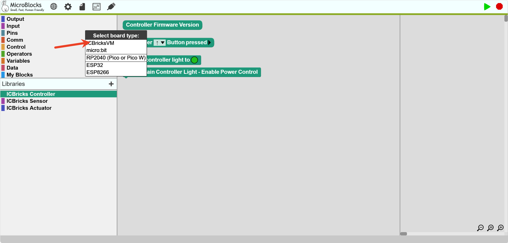

4. Select the device from the browser dialog, then click "Connect."  

<!-- 这是一张图片，ocr 内容为： -->
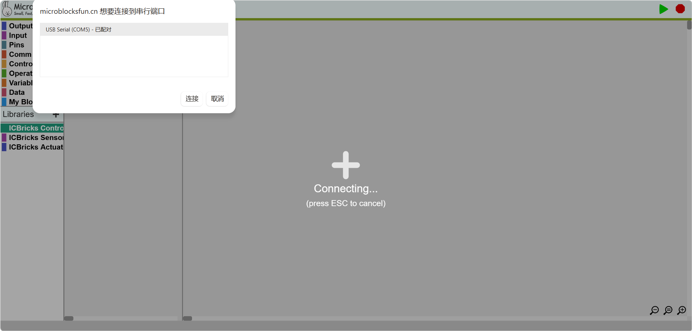

## Connecting Devices  
### Wired Connection  
1. Turn on the hub.  
2. Insert the hub and connect it to the computer.  

<!-- 这是一张图片，ocr 内容为： -->
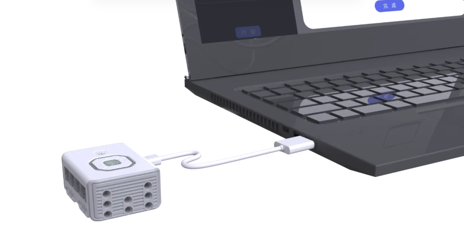

3. Click the "Connect" button and select "Board Connection."  

<!-- 这是一张图片，ocr 内容为： -->
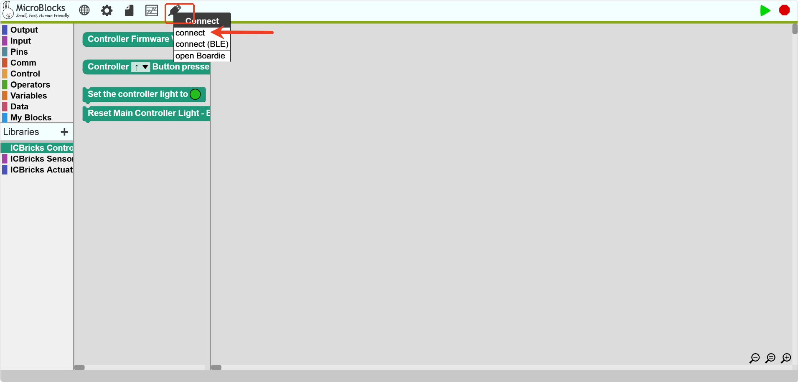

4. Select the device from the browser dialog, then click "Connect."  

<!-- 这是一张图片，ocr 内容为： -->
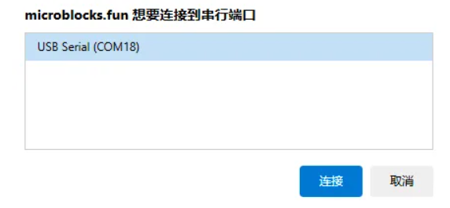

5. If you have installed the ICBricks firmware, the USB icon will show a green circle.  

<!-- 这是一张图片，ocr 内容为： -->
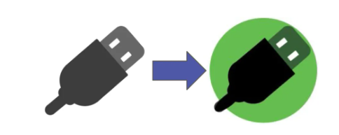

Now, you can use MicroBlocks to program your board!  

### Wireless Connection  
1. Turn on the hub.  
2. Click the "Connect" button and select "Wireless Connection."  

<!-- 这是一张图片，ocr 内容为： -->
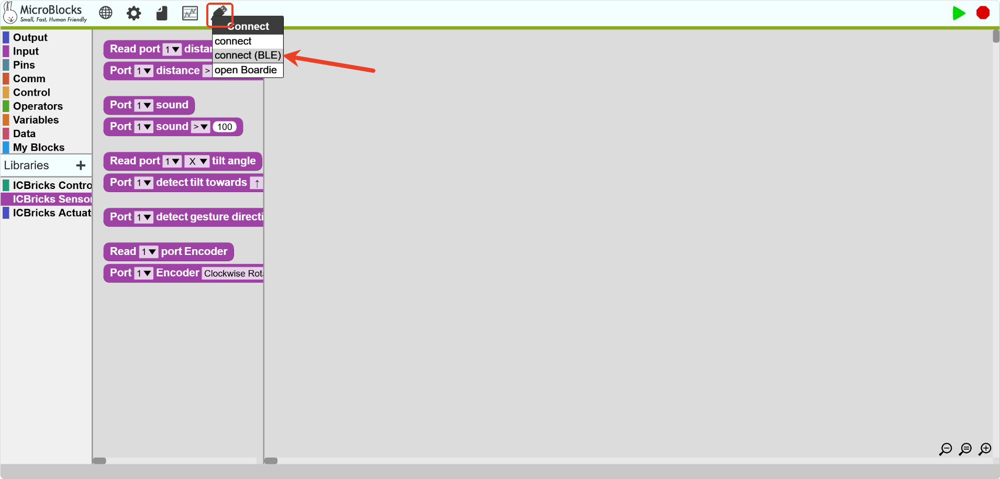

3. Select the device from the browser dialog, then click "Connect."  

<!-- 这是一张图片，ocr 内容为： -->
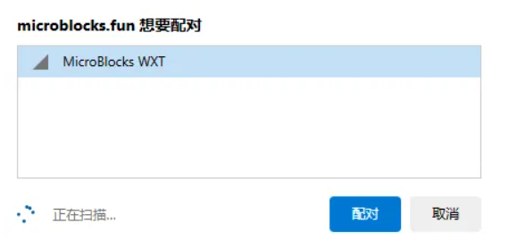

4. Once connected successfully, the USB icon will show a green circle.  

<!-- 这是一张图片，ocr 内容为： -->
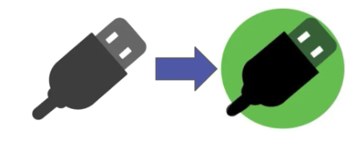

Now, you can use MicroBlocks to program your board!  

## Starting Coding  
1. Drag blocks to edit the program.  

<!-- 这是一张图片，ocr 内容为： -->
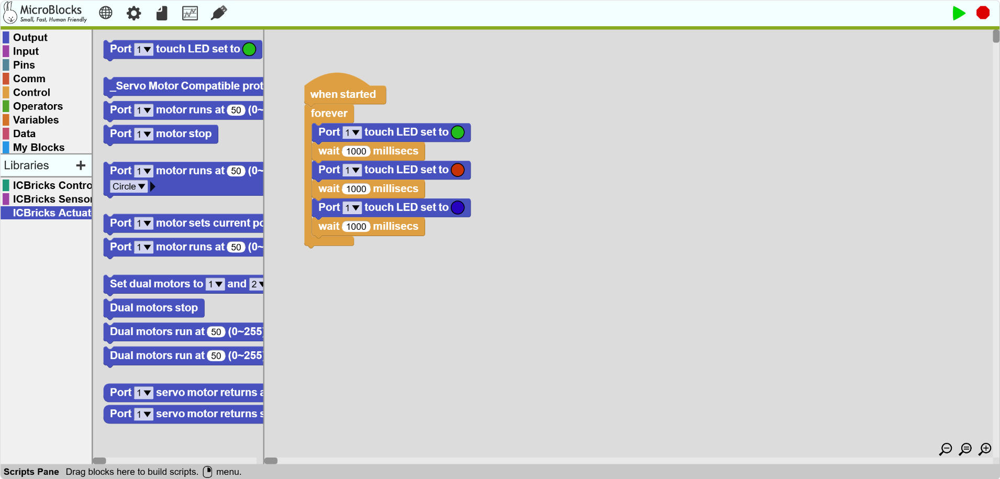

1. Click the "Start" button to run the program.  

<!-- 这是一张图片，ocr 内容为： -->
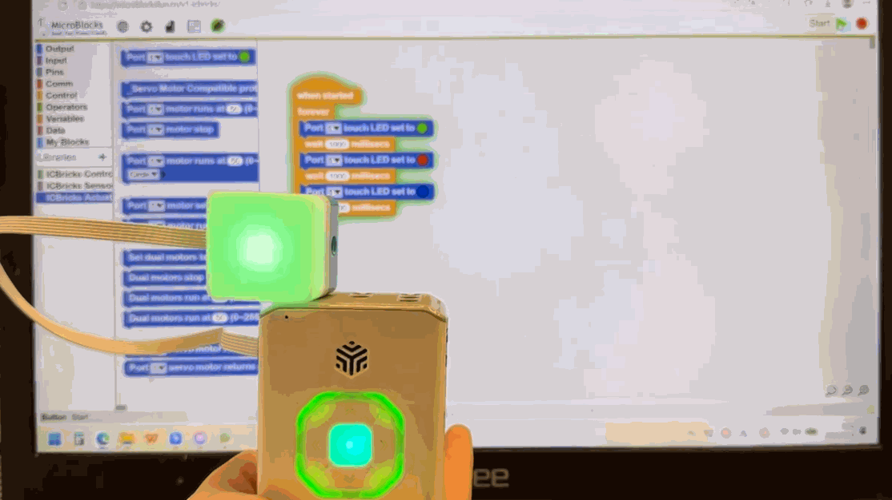

## More  
If you'd like to learn more and explore further, visit the [MicroBlocks official website](https://microblocksfun.cn/) to access more resources and tutorials, and gain a deeper understanding of the MicroBlocks coding environment.  

